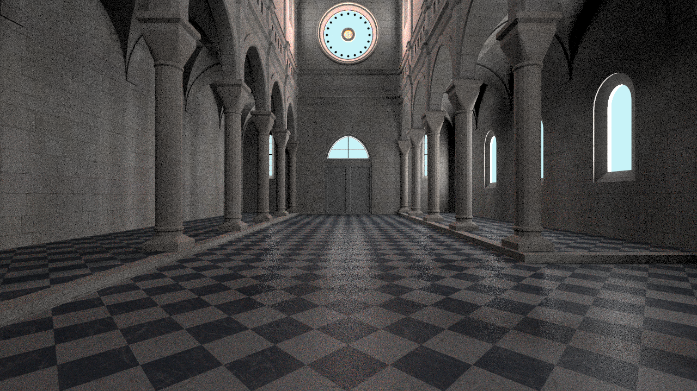
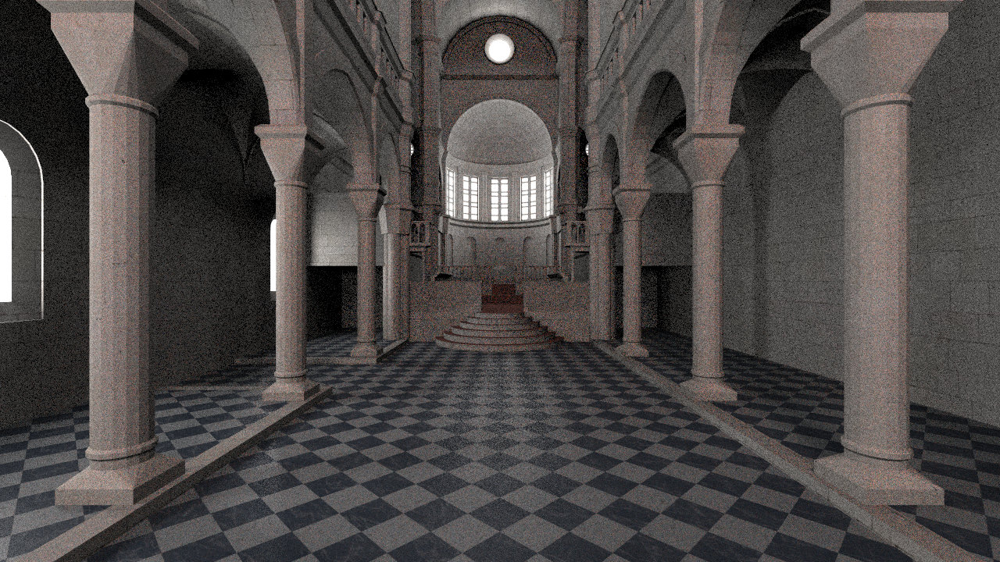

# Yet another Raytracer

A little (and yet very basic) raytracer. It supports local and direct illumination. Global illumination is coming soon ~~hopefully~~. There is no documentation yet, but it is on my ToDo-List.

The raytracer loads an obj-File and (hopefully) outputs a photorealistic image.
Look at the jobs file for the configuration.

## Installation

````
git clone git@github.com:vincentgierisch/simpleRayTracer
cd simpleRayTracer
make
````

## Run

To start the script, run the following command:
````
./bin/srtRenderer -s jobs/testJob
````  
For a live preview, run:
````
./bin/srtRenderer -l -s jobs/testJob
````  

## Images produced by the raytracer
Two images produced by this raytracer. I used the well known sibenik model for it and sampled it with 1000sspx (takes about 25min on my machine).

